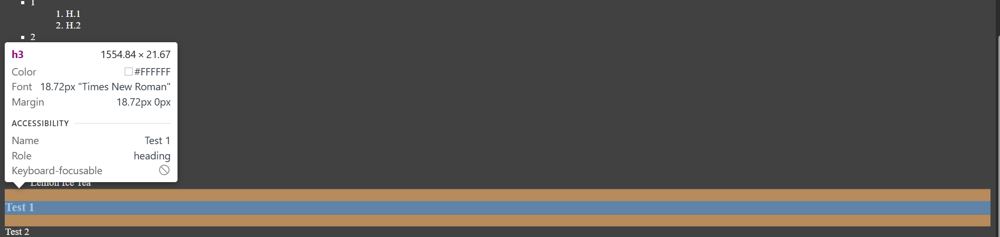
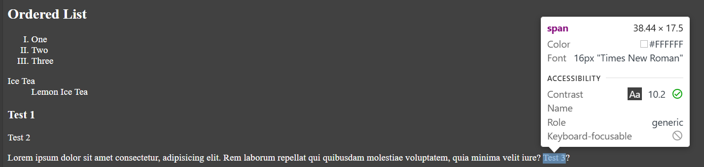

## Tables
- tr -- table row
- th -- table heading
- td -- table data
- After adding table, while adding heading we can use tab to move to other headins, like 1st heading entered press tab to go to 2nd and soo on.
- colspan is used to give more space to a column

## Lists
- ul>li*5{1} -- we can make an unordered list with numbering alongwith bullets by using this.
- Unordered List -- style="list-style-type: square; by using this we can change the bullets style.
- Ordered List - It will have by default bullets as numbers
- Unordered List - It can have bullet points & different styles for the same
- We can use type attribute in Ordered list
- We can make nested list as well

## Block Level/In-line Element
- While inspecting an element if it takes the entire space on the page are Block level Elements

- While inspecting an element if it takes a specific place then it is inline element.

## Class
- It is used to target and select an element.
- Classes in styling are denoted by .classname

## Id
- Id in styling is denoted by #idname
- Ideally only one id should be there for the entire page

## Iframe
- Helps loading another webpage, youtub video, etc on an Existing Web Page.
- The video you are taking will have id starting with 3j and ending with Vk.
- Vimeo is also website which can be used for adding videos.

## Head
- title -- the tab of the page contains the mname specififed in this.
- style -- to decorate the page
- link -- if we are iport .css file this is used, rel means the relation, mostly stylesheet is used for adding .css file, href contains the path to the location of .css file.
- meta -- this is used to define character set attribute , UTF-16 supports smiley.
- name = "keywords"
- meta name="viewport" content="width=device-width, initial-scale=1.0" -- this defines the scale and Zoom of webpage, mostly used for movie devices as on laptops it was alreay designed earlier.
script - it is used for loading a javascript file.

## Codes
- code tag -- any sort of code in python, java, etc should be accumulated here.
- kbd - keyboard input -- If we want to enter some linux commands we can use this.

